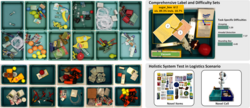
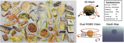
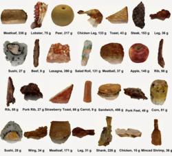

## Datasets

### MetaGraspNet

A comprehensive dataset for robotic grasping and manipulation research.  
[View on GitHub](https://github.com/maximiliangilles/MetaGraspNet?tab=readme-ov-file)

### MetaFood3D Dataset

A large-scale dataset for 3D food analysis and understanding.  
[Access Dataset](https://lorenz.ecn.purdue.edu/~food3d/)

### NutritionVerse 3D

A comprehensive dataset for nutritional analysis of food items in 3D.  
[View on Kaggle](https://www.kaggle.com/datasets/amytai/nutritionverse-3d)
